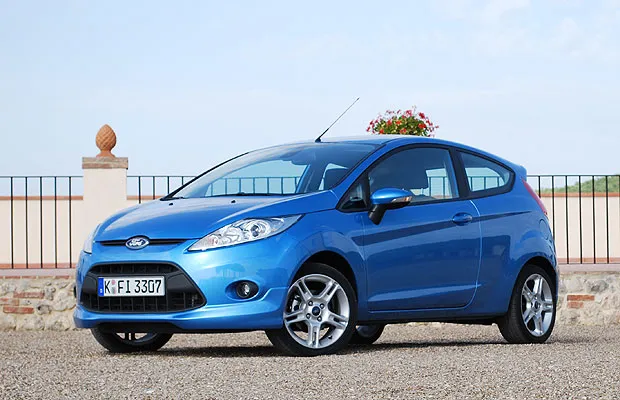
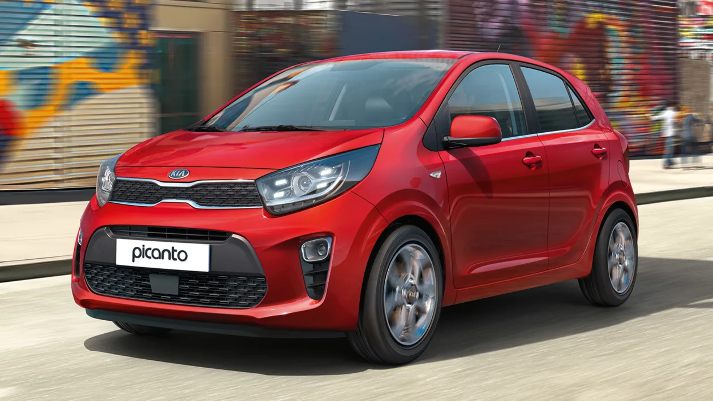
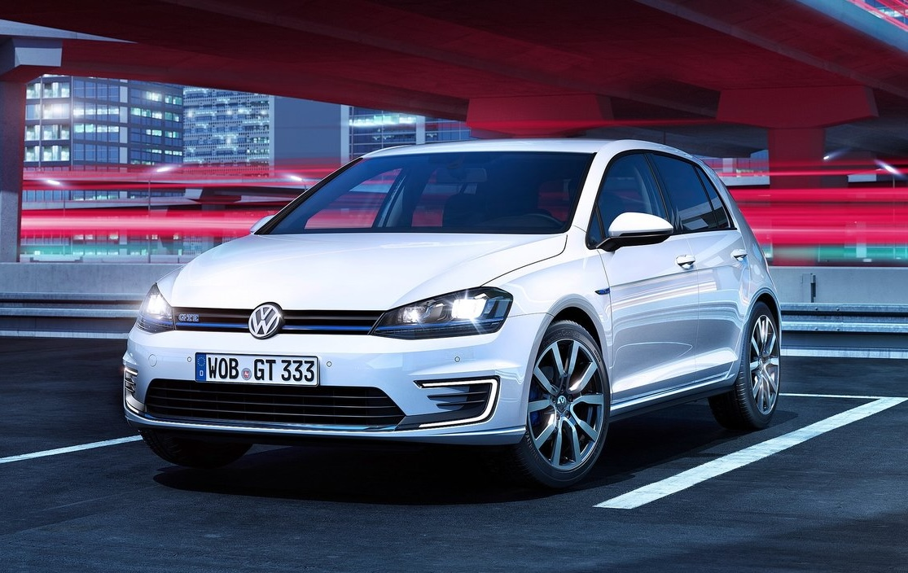

# CarMatch-AI

Bu proje, UREKTEN YAPAY ZEKA VE ETMEN ODAKLI YAPAY ZEKA adlı üniversite dersi kapsamında geliştirilen bir uygulamadır. Amaç, kullanıcının girdiği özelliklere göre otomobilleri filtreleyip sıralayabilen basit bir yapay zeka destekli sistem oluşturmaktır. Proje mümkün olduğunca sade bir dilde yazılmıştır; teknik ayrıntılar sizi yormadan hızlıca kullanılabilir.

## 🚗 Proje Hakkında

- **CarMatch-AI**, kullanıcının otomobil tercihlerini analiz eder ve veri tabanındaki araçları buna göre listeler.
- Python ile yazılmış bir arka uç (backend) ve temel HTML/JavaScript/CSS kullanılarak basit bir ön yüz (frontend) içerir.
- Veri, `cars_database.csv` adlı dosyada tutulur.
- Dört temel ajan (agent) vardır:
  - **filter_agent**: Girilen kriterlere göre araçları süzer.
  - **query_analyzer**: Kullanıcı sorgusunu parçalayıp hangi özelliklerin istendiğini çıkarır.
  - **ranking_agent**: Elde edilen sonuçları puanlayıp sıralar.
  - **llm_agent**: Basit doğal dil işlemi için kullanılmaya uygun bir modüldür (mevcut haliyle örnek amaçlı).


## 📁 Dosya Yapısı

```
CarMatch-AI-Final/
  app.py                # Uygulamanın ana dosyası
  cars_database.csv     # Araç verileri
  requirements.txt      # Gereken Python paketleri
  agents/               # Yardımcı ajan modülleri
  frontend/             # HTML/CSS/JS dosyaları
```

## ⚙️ Kurulum ve Çalıştırma

1. Bu depoyu bilgisayarınıza klonlayın veya indirin.
2. Python 3.8 veya üstü yüklü olduğundan emin olun.
3. Sanal ortam oluşturup aktifleştirin (isteğe bağlı ama önerilir):
   ```powershell
   python -m venv venv
   .\venv\Scripts\Activate
   ```
4. Gerekli paketleri yükleyin:
   ```powershell
   pip install -r CarMatch-AI-Final\requirements.txt
   ```
5. Uygulamayı başlatın:
   ```powershell
   python CarMatch-AI-Final\app.py
   ```
6. Tarayıcınızda `http://localhost:5000` adresini açın.


## 📝 Kullanım

- Sayfaya giriş yaptıktan sonra araç arama kutusuna isteğinizi yazın (örneğin "2020 model SUV" veya "elektrikli sedan").
- Uygulama sorgunuzu analiz eder ve en uygun araçları listeler.
- Sonuçları ana sayfada görebilirsiniz.


## 📌 Önemli Notlar

- Proje eğitim amaçlıdır ve gerçek üretim sistemleri için tasarlanmamıştır.
- Veri kümesi sabittir; yeni araç eklemek için CSV dosyasını elle düzenleyebilirsiniz.
- Kodlar sade tutulmuş, anlaşılması kolay hedeflenmiştir.


## 🔧 Geliştirme

- Yeni özellikler eklemek isterseniz `agents` klasöründeki dosyalara bakabilirsiniz.
- Ön yüzde değişiklik yapmak istediğinizde `frontend/index.html` ve `frontend/script.js` üzerinde çalışabilirsiniz.

## 📷 Ekran Görüntüleri (Screenshots)

Projeyi daha iyi anlamak için bazı örnek görseller ekledik. Depoda mevcut araç resimlerini kullanabilir veya kendi ekran görüntülerinizi aynı klasöre (`frontend/images`) ekleyip burada referanslayabilirsiniz.

1. **Ana arayüz:** Uygulama açıldığında kullanıcıların gördüğü basit form.  
   

2. **Prompt girme anı:** Kullanıcının arama isteğini yazdığı kutu örneği.  
   

3. **Sonuç listesi:** Analiz edildikten sonra gelen sıralanmış araç çıktı.  
   

> **Not:** Yukarıdaki resim bağlantıları proje içindeki `frontend/images` klasöründeki örnek araç görsellerine yönlendirir. GitHub üzerinde gerçek ekran görüntüleri kullanmak için kendi `.png` veya `.jpg` dosyalarınızı aynı klasöre ekleyip burada referans verin.

## 📄 Lisans

Bu proje herhangi bir lisans dosyası içermiyor. Kullanım ve paylaşım serbesttir.

---

Umarım kullanımı kolay bulursunuz. Başarılar! 😊
